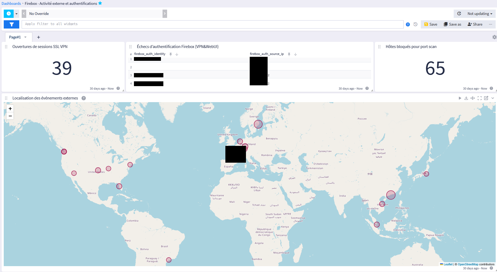
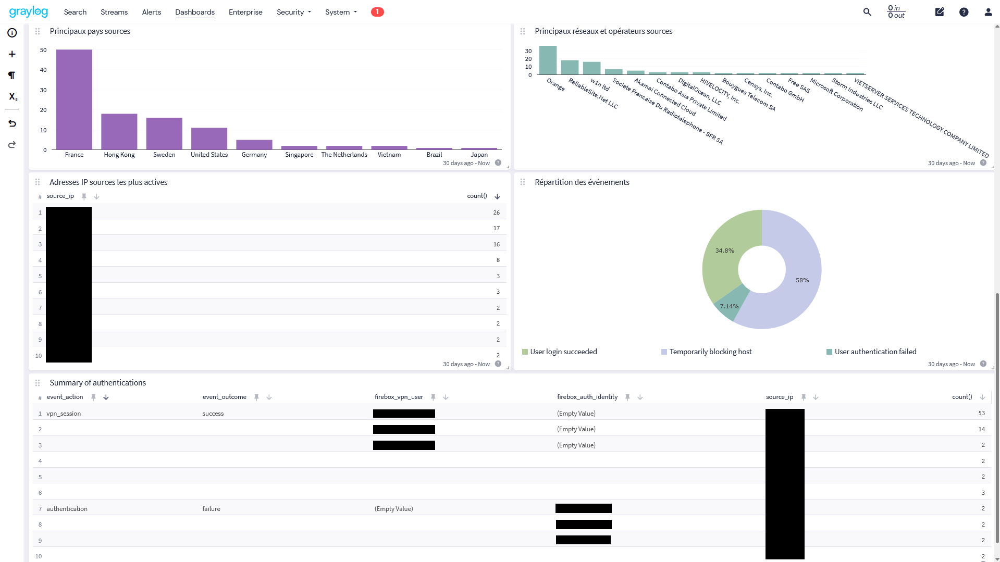
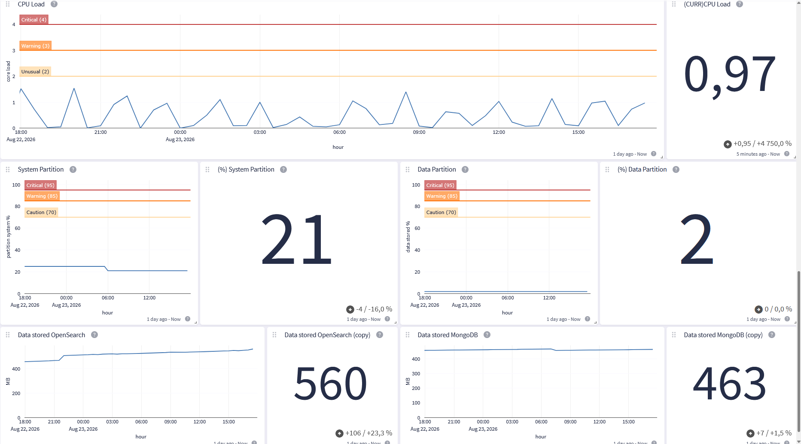
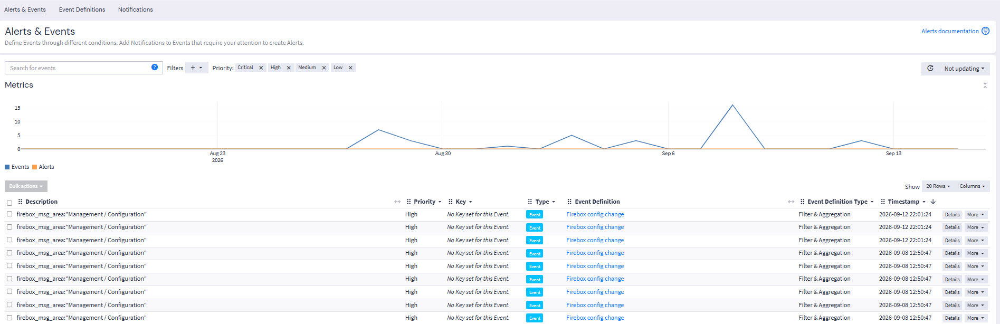

# Graylog Security Monitoring Platform

Graylog Open project for centralized logging and security monitoring, built during a network and systems internship.

## Overview

This repository documents the deployment and configuration of a centralized logging platform based on Graylog Open.

The project was implemented in a real small-business infrastructure. The main need was to centralize logs from different systems and make them easier to use for monitoring, troubleshooting and security analysis.

The project covers log collection, message parsing, field normalization, GeoIP enrichment, dashboards, event detection and basic host monitoring.

This fits into the **Detect (DE)** function of the NIST Cybersecurity Framework 2.0, mainly through continuous monitoring and adverse event analysis.

## Project Goals

- Centralize logs from network devices and a Windows pilot  
  _Supports: PR.PS-04, DE.CM-01, DE.CM-09_

- Convert raw vendor logs into structured and searchable messages  
  _Supports: DE.AE-02_

- Improve visibility into network and security-related activity  
  _Supports: DE.CM-01, DE.CM-09, DE.AE-02_

- Build dashboards and event definitions for relevant activity  
  _Supports: DE.AE-06_

- Add GeoIP and ASN context to public source IP addresses  
  _Supports: DE.AE-07_

- Automate GeoIP database updates

- Document technical decisions and troubleshooting work

[PR.PS-04: Log records are generated and made available for continuous monitoring](https://csf.tools/reference/nist-cybersecurity-framework/v2-0/pr/pr-ps/pr-ps-04/)  
[DE.CM: Security Continuous Monitoring](https://csf.tools/reference/nist-cybersecurity-framework/v2-0/de/de-cm/)  
[DE.AE: Adverse Event Analysis](https://csf.tools/reference/nist-cybersecurity-framework/v2-0/de/de-ae/)

## Main Components

- Graylog Open
- Ubuntu Server
- Graylog Data Node
- MongoDB
- WatchGuard Firebox
- Zyxel network switches
- Graylog Sidecar and Winlogbeat
- MaxMind GeoLite2 City and ASN
- systemd

## Main Use Cases

### WatchGuard Firebox

The Firebox integration is the most developed part of the project.

It includes:

- UDP syslog ingestion;
- stream routing and multi-stage pipeline processing;
- WatchGuard `msg_id` extraction and catalog enrichment;
- parsing of blocked hosts, SSLVPN sessions, authentication failures and DHCP events;
- normalization of relevant public addresses into `source_ip`;
- automatic GeoIP and ASN enrichment;
- dashboards for external and authentication-related activity.

More details are available in [docs/firebox-processing.md](docs/firebox-processing.md).

### Zyxel Switches

Five Zyxel switches send their logs to a shared syslog input.

The integration includes field extraction for selected events, link state monitoring, administrator authentication parsing and Event Definitions for STP/RSTP and uplink activity.

More details are available in [docs/zyxel-switch-monitoring.md](docs/zyxel-switch-monitoring.md).

### Windows Pilot

Graylog Sidecar and Winlogbeat were tested on one Windows PC to validate Windows event collection and routing into a dedicated stream.

This remained a pilot and was not deployed company-wide.

## Architecture

Logs are collected through inputs separated by source type.

Messages enter the Default Stream and are evaluated by Graylog pipelines where needed. The pipelines are used for source identification, stream routing, parsing and field normalization.

For supported IP fields, Graylog's built-in GeoIP Resolver runs after the Pipeline Processor and adds MaxMind City and ASN information before indexing.

The overall architecture, storage layout and processing flow are documented in [docs/architecture.md](docs/architecture.md).

## Dashboards and Monitoring

### Security and Network Activity

Graylog dashboards were created to make the processed logs easier to investigate and monitor.

They include information such as:

- external source locations;
- source countries;
- ASNs and associated providers;
- active source IP addresses;
- blocked hosts;
- SSLVPN activity;
- authentication failures.

### Graylog Host Monitoring

The Graylog host is also monitored through the platform itself.

A small Bash script runs every five minutes through a systemd timer and collects basic host and application health metrics, including CPU, memory and disk usage, storage growth and Graylog service status.

The metrics are sent to a local Graylog input and displayed in a dedicated health dashboard.

## Detection Rules (Event Definitions)

Several detection rules were created using Graylog Event Definitions.

Event Definitions define the conditions used to generate Events. Notifications can then be added to Events, creating Alerts.

For example, one Event Definition monitors Firebox configuration-related activity.

It searches for messages classified under the WatchGuard `Management / Configuration` area and generates high-priority Events when matching activity is found.

This makes configuration changes easier to notice without relying only on manual log searches.

## Technical Challenges

Some of the main issues encountered during the project were:

- adapting the parsing to different vendor log formats;
- troubleshooting the order of Graylog message processors and GeoIP enrichment;
- configuring permissions and automatic updates for the MaxMind databases;
- dealing with log sources that generated too much noise for their actual monitoring value.

## Notes and Future Work

The Firebox integration is the most developed part of the project.

Five Zyxel switches are also integrated, while Windows event collection remained limited to one pilot PC.

Access point logs were evaluated but disabled because of their excessive volume and the limited filtering available before ingestion.

Had several other ideas but did not have enough time to implement them during the internship.

Some possible extensions were:

- adding notifications to important Event Definitions;
- collecting Microsoft 365 / Entra ID sign-in activity;
- collecting Windows security events from the domain controller;
- creating detection rules for unusual authentication activity, such as connections from unexpected public IP addresses;
- integrating some detections with external automation for response actions.
