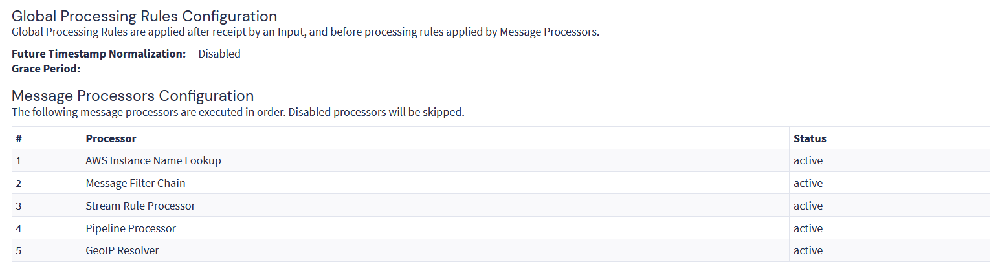

# Architecture

## Overview

This project is based on a Graylog Open server deployed in a small-business network.

The platform centralizes logs from network devices and a Windows pilot, while also monitoring the Graylog host itself.

Graylog pipelines are used to route messages, extract useful fields and normalize data when needed. The processed messages can then be used for searches, dashboards and event detection.

The architecture shown here has been simplified and anonymized.

## Main Components

| Component | Role |
|---|---|
| Ubuntu Server | Operating system hosting the Graylog platform |
| Graylog Server | Log ingestion, processing, search and visualization |
| Graylog Data Node | OpenSearch-based storage and indexing backend |
| MongoDB | Graylog configuration and metadata storage |
| Dedicated `/data` volume | XFS storage for indexes, the message journal, GeoIP databases and lookup files |
| WatchGuard Firebox | Main firewall and security log source |
| Zyxel switches | Network and topology-related log sources |
| Graylog Sidecar | Management of the Windows collector configuration |
| Winlogbeat | Windows event collection on the pilot PC |
| MaxMind GeoLite2 | Geographic and ASN enrichment |
| systemd | Scheduling of recurring tasks and host monitoring |

## Log Sources

| Source | Collection method | Scope |
|---|---|---|
| WatchGuard Firebox | Dedicated UDP syslog input | Security, VPN and authentication activity |
| Five Zyxel switches | Shared UDP syslog input | Network and STP/RSTP monitoring |
| Windows pilot PC | Graylog Sidecar, Winlogbeat and Beats input | Windows event collection pilot |
| Graylog host | Bash script and local UDP input | Platform health monitoring |

Inputs are separated by source type. Devices of the same type can share the same input, which is the case for the five switches.

Access point logs were also tested but were disabled because of their excessive volume and the limited filtering available before ingestion.

## High-Level Data Flow

Logs are received through Graylog inputs configured for the different collection methods.

Messages initially enter the Default Stream. Pipelines connected to this stream are then evaluated by the Pipeline Processor.

```text
Log sources
    |
    v
Graylog inputs
    |
    v
Default Stream
    |
    v
Pipeline Processor
    |
    ├── Identify the source
    ├── Route messages to streams
    ├── Extract useful fields
    ├── Query lookup tables when needed
    └── Normalize selected IP addresses
    |
    v
GeoIP Resolver
    |
    └── Add MaxMind City and ASN data when applicable
    |
    v
Graylog Data Node
    |
    v
Search, dashboards and events
```

Stream assignment is performed by pipeline rules.

A message can be assigned to a stream in an early pipeline stage and still continue through the remaining stages of that pipeline.

Streams are mainly used here to separate the different sources and to scope searches, dashboards and Event Definitions.

## Server and Storage Layout

Graylog Open was installed on Ubuntu Server.

A dedicated XFS filesystem mounted on `/data` separates the main Graylog data from the operating system disk.

```text
System disk
├── Ubuntu Server
├── Graylog Server
├── Graylog Data Node application
└── MongoDB

Dedicated XFS volume
└── /data
    ├── datanode/
    │   └── opensearch/
    │       └── Data Node indexes
    └── graylog/
        ├── journal/
        ├── geoip/
        └── lookups/
```

The main paths used by the project are:

```text
/data/datanode/opensearch
/data/graylog/journal
/data/graylog/geoip
/data/graylog/lookups
```

This keeps the operating system and log-related persistent data on separate filesystems.

## GeoIP and ASN Enrichment

Selected public IP addresses are normalized into the common `source_ip` field by pipeline rules.

Graylog's built-in GeoIP Resolver uses the MaxMind GeoLite2 City and ASN databases stored under `/data/graylog/geoip`.

The Pipeline Processor runs before the GeoIP Resolver. This is important because some pipeline rules create `source_ip` from values extracted from raw logs.

```text
Pipeline Processor
        |
        └── creates source_ip when applicable
                |
                v
        GeoIP Resolver
                |
                ├── geographic information
                └── ASN information
```



The resulting fields are used in searches and dashboards for information such as source countries, geographic location and ASN/provider context.

The MaxMind databases are updated automatically with `geoipupdate`.

## Graylog Host Monitoring

The Graylog server also monitors its own basic health.

A Bash script runs every five minutes through a systemd timer, collects host and application metrics and sends them to a local Graylog UDP input.

The collected data includes basic CPU, memory, disk, storage and service health information and is displayed in a dedicated dashboard.

This provides visibility into the platform itself in addition to the external log sources it monitors.
