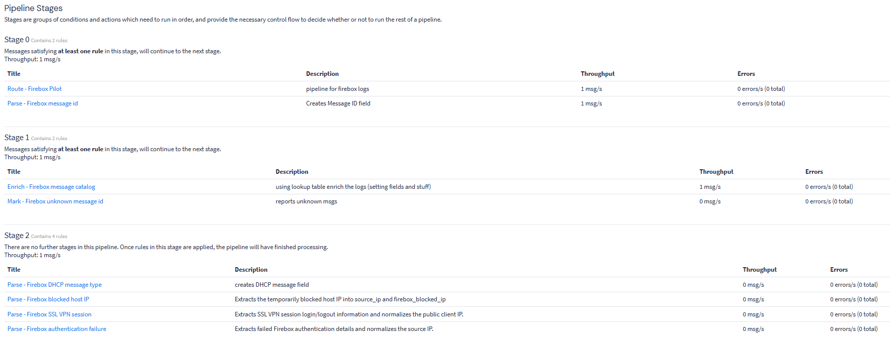
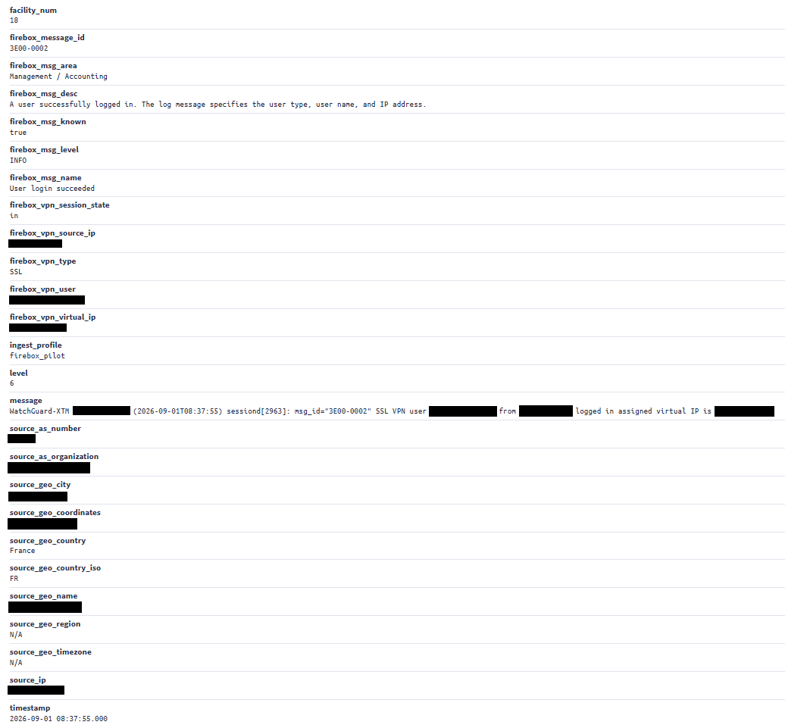

# WatchGuard Firebox Processing

## Overview

The WatchGuard Firebox integration is the most developed part of this project.

Firebox logs are received through a dedicated UDP syslog input. They initially enter the Default Stream, where a dedicated Graylog pipeline identifies, routes and parses selected messages.

The goal is not to parse every possible Firebox log. The implementation focuses on messages that are useful for monitoring, security analysis and troubleshooting.

## Processing Flow

```text
WatchGuard Firebox
    |
    v
Dedicated UDP syslog input
    |
    v
Default Stream
    |
    v
Firebox pipeline
    |
    ├── Stage 0: identify and route Firebox messages
    ├── Stage 1: enrich known WatchGuard message IDs
    └── Stage 2: parse selected event types
    |
    v
GeoIP Resolver
    |
    v
Indexing, searches, dashboards and events
```

### Pipeline Implementation

The Firebox processing is split into three stages, separating source identification, message catalog enrichment and event-specific parsing.



## Stage 0 — Identification and Initial Extraction

The first stage contains two independent rules.

The first rule identifies messages received through the Firebox input. When it matches, it:

- assigns the message to the Firebox stream;
- sets an `ingest_profile` field;
- sets an `asset_type` field.

The second rule extracts the WatchGuard `msg_id` from the raw message and stores it in:

```text
firebox_message_id
```

The two rules are independent and can run in the same stage.

For a typical Firebox message containing a `msg_id`, this stage produces routing metadata and a reusable message identifier.

```text
Raw Firebox message
    |
    ├── assigned to the Firebox stream
    ├── ingest_profile set
    ├── asset_type set
    └── firebox_message_id extracted
```

## Stage 1 — WatchGuard Message Catalog

The second stage uses `firebox_message_id` to query a CSV lookup table based on the WatchGuard message catalog.

Known message IDs are enriched with readable information such as:

- message name;
- functional area;
- severity level;
- description.

This makes vendor-specific message IDs easier to search, filter and understand.

```text
firebox_message_id
    |
    v
WatchGuard message catalog lookup
    |
    ├── firebox_msg_known
    ├── firebox_msg_level
    ├── firebox_msg_area
    ├── firebox_msg_name
    └── firebox_msg_desc
```

Unknown message IDs are marked so they can be found and reviewed later.

Depending on the message, the catalog can then be updated or a dedicated parsing rule can be added.

## Stage 2 — Event-Specific Parsing

The final stage contains dedicated parsing rules for selected Firebox event types.

These rules extract useful values directly from the raw message when the catalog information alone is not enough.

Implemented examples include:

| Event type | Purpose |
|---|---|
| DHCP events | Identify DHCP-related activity |
| Temporarily blocked hosts | Extract the blocked public IP address |
| SSLVPN sessions | Extract VPN user, source IP, virtual IP and session state |
| Authentication failures | Extract rejected identity, source IP and failure reason |

## Source IP Normalization

Different Firebox messages can contain a useful public IP address in different fields.

When a relevant source address is extracted, it is also stored in a common normalized field:

```text
source_ip
```

This field is then available for GeoIP and ASN enrichment.

Examples:

```text
Blocked host event
    └── firebox_blocked_ip
        └── source_ip

SSLVPN session
    └── firebox_vpn_source_ip
        └── source_ip

Authentication failure
    └── firebox_auth_source_ip
        └── source_ip
```

## GeoIP and ASN Enrichment

The Firebox pipeline does not perform the MaxMind lookup itself.

Its role is to extract and normalize the relevant public address into `source_ip`.

After the Pipeline Processor runs, Graylog's built-in GeoIP Resolver enriches this field using the configured MaxMind GeoLite2 City and ASN databases.

```text
Firebox parser
    |
    v
source_ip
    |
    v
GeoIP Resolver
    |
    ├── source_geo_country
    ├── source_geo_country_iso
    ├── source_geo_coordinates
    ├── source_as_number
    └── source_as_organization
```

The pipeline handles parsing and normalization, while Graylog handles the geographic and ASN enrichment.

### Example Parsing Rule

One example is the SSLVPN parser, which extracts session information and normalizes the public client address into `source_ip`.

```text
rule "Parse - Firebox SSL VPN session"
when
  has_field("firebox_message_id")
  &&
  (
    to_string($message.firebox_message_id) == "3E00-0002"
    ||
    to_string($message.firebox_message_id) == "3E00-0004"
  )
  &&
  has_field("message")
  &&
  contains(
    value: to_string($message.message),
    search: "SSL VPN user",
    ignore_case: false
  )
then
  let parsed = grok(
    pattern: ".*SSL VPN user %{NOTSPACE:firebox_vpn_user} from %{IP:firebox_vpn_source_ip} logged %{WORD:firebox_vpn_session_state} assigned virtual IP is %{IP:firebox_vpn_virtual_ip}$",
    value: to_string($message.message),
    only_named_captures: true
  );

  let source_ip = to_string(parsed.firebox_vpn_source_ip);

  set_field("source_ip", source_ip);
  set_field("firebox_vpn_source_ip", source_ip);

  set_field(
    "firebox_vpn_user",
    to_string(parsed.firebox_vpn_user)
  );

  set_field(
    "firebox_vpn_virtual_ip",
    to_string(parsed.firebox_vpn_virtual_ip)
  );

  set_field(
    "firebox_vpn_session_state",
    to_string(parsed.firebox_vpn_session_state)
  );

  set_field("firebox_vpn_type", "SSL");
  set_field("event_action", "vpn_session");
  set_field("event_outcome", "success");
end
```

### Example of an Enriched Message

The resulting message can contain information from several processing steps at the same time:

- the original WatchGuard message ID;
- metadata from the WatchGuard message catalog;
- fields extracted by the event-specific parser;
- the normalized `source_ip`;
- GeoIP and ASN information added by Graylog.



## Implemented Use Cases

### Blocked Hosts and Port-Scan-Related Activity

Some Firebox messages indicate that a host was temporarily blocked.

The parser extracts the blocked IP address, making it possible to search and visualize these sources by IP, country and ASN.

### SSLVPN Sessions

SSLVPN session messages are parsed to extract:

- VPN username;
- public source IP address;
- assigned virtual IP address;
- session state.

The pipeline also sets:

```text
event_action = vpn_session
event_outcome = success
```

This makes VPN activity easier to filter and investigate.

### Authentication Failures

Authentication failure messages are parsed to extract:

- user type;
- rejected identity;
- public source IP address;
- failure reason.

The pipeline sets:

```text
event_action = authentication
event_outcome = failure
```

This makes failed authentication activity easier to search and analyze.

### DHCP Events

DHCP-related Firebox messages are identified and the DHCP message type is extracted when available.

The same WatchGuard message ID can be used for DHCP OFFER and ACK messages, so extracting the message type allows more specific filtering.

## Processing Steps

The Firebox processing flow can be summarized as:

1. identify the source;
2. route the message;
3. extract the WatchGuard message ID;
4. enrich known IDs using the catalog;
5. mark unknown IDs for later review;
6. parse selected event types;
7. normalize useful public addresses into `source_ip`;
8. let Graylog add GeoIP and ASN information.

## Current Scope

High-volume traffic logs are not part of the documented scope.

Parsing them would require a separate review of log volume, retention, storage impact and monitoring value.
