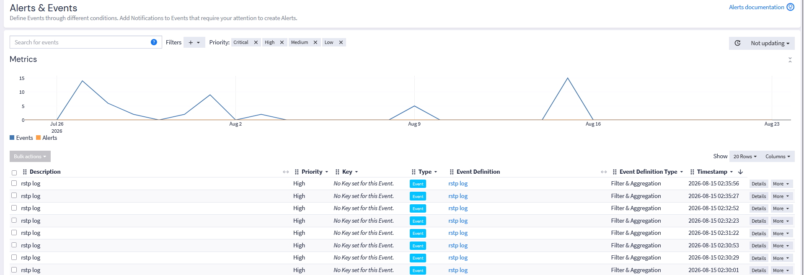

# Zyxel Switch Monitoring

## Overview

Logs from five Zyxel switches are collected through a shared UDP syslog input.

The integration focuses on useful operational events rather than trying to parse every message generated by the switches.

The main monitored events include link state changes, administrator authentication and STP/RSTP-related activity.

## Collection

All five switches use the same Graylog syslog input:

```text
Input type: Syslog UDP
Source type: Zyxel switches
Transport: UDP
```

Messages received through this input initially enter the Default Stream.

A dedicated Graylog pipeline identifies these messages, adds source metadata and routes them to the Zyxel stream.

## Pipeline Flow

```text
Zyxel switches
    |
    v
Shared UDP syslog input
    |
    v
Default Stream
    |
    v
Zyxel pipeline
    |
    ├── Stage 0: route Zyxel messages
    ├── Stage 1: extract common fields
    └── Stage 2: parse selected event types
    |
    v
Zyxel stream
    |
    v
Search, dashboards and Event Definitions
```

## Stage 0 — Routing

The first stage identifies messages received through the Zyxel syslog input.

When a message matches, the pipeline:

- assigns it to the Zyxel stream;
- sets an `ingest_profile` field;
- sets an `asset_type` field;
- sets a `device_vendor` field.

This separates switch logs from the other collected sources and makes them easier to use in searches and Event Definitions.

## Stage 1 — Base Field Extraction

The second stage extracts common information from the raw syslog message.

The parser accepts both classic syslog and ISO 8601 timestamps to handle the different formats found in the collected messages.

It extracts:

```text
device_hostname
zyxel_event_category
zyxel_event_message
```

These fields can then be reused by more specific parsing rules and searches.

## Stage 2 — Selected Event Parsing

The final stage contains dedicated parsers for selected types of switch activity.

### Interface Link State

Link state messages are parsed when a switch reports a port status change.

Extracted fields include:

```text
device_hostname
zyxel_port
zyxel_link_state
zyxel_link_mode
zyxel_event_type
```

The pipeline also sets:

```text
zyxel_event_type = port_link_state
```

This makes port up/down events easier to identify and allows important uplink ports to be monitored.

### Administrator Authentication

Administrator authentication messages are also parsed.

Extracted fields include:

```text
device_hostname
zyxel_admin_user
zyxel_admin_action
zyxel_admin_ip
zyxel_event_type
```

The pipeline sets:

```text
zyxel_event_type = admin_auth
```

This provides basic visibility into administrative access to the switches.

## Event Definitions

Two Graylog Event Definitions were created for selected switch activity.

### STP/RSTP Activity

One Event Definition searches the Zyxel stream for STP/RSTP-related messages using:

```text
zyxel_event_category:stp
```

It runs every five minutes and searches the previous five-minute period.

This makes topology-related events easier to notice without having to search the raw logs manually.

### Uplink Port Activity

A second Event Definition monitors link activity on selected uplink ports.

It can surface port state changes affecting important links between network devices.



## Current Scope

The Zyxel integration currently covers:

- routing logs from five switches to a dedicated stream;
- extracting common fields from different syslog formats;
- parsing interface link state events;
- parsing administrator authentication events;
- detecting STP/RSTP-related activity;
- monitoring selected uplink ports.

The Event Definitions are used for detection and visibility.
